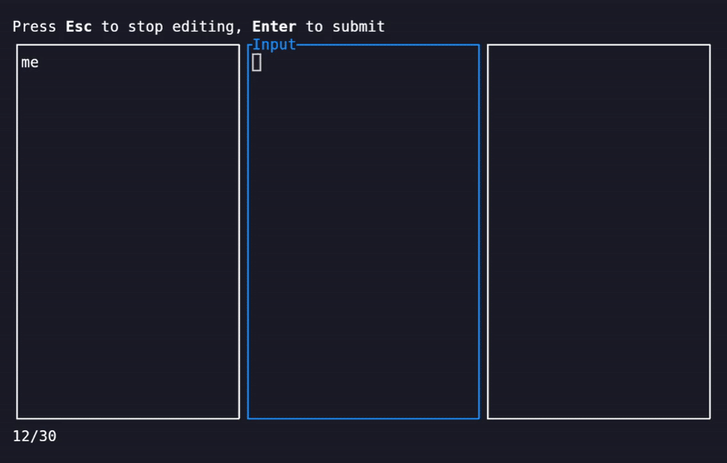

<p align="center">

<h1 align="center">RuVoLA</h1>
</p>


RuVoLA (**R**usty **Vo**cabulary **L**earning **A**pplication) is a TUI based application for learning vocabulary written in Rust. As opposed to flashcard programs like [vocage](https://github.com/proycon/vocage) or [anki](https://apps.ankiweb.net/), the user is here required to type the vocabularies similar to the [phase6](https://www.phase-6.de/) platform. 

To ensure that words with a higher error rate are repeated more often, VOLE employs a system similar to vocage where the words are moved decks with each deck having a different presentation interval. 



## Features
- Similar to vocage, the data is stored in a simple plain-text tab-separated values format (TSV)
    - Here, however, the TSV files can only contain two columns
    - The learning progress is also directly stored in the TSV file, allowing you to store the vocabularies and learning progress in a version control system like git
- Multiple vocabulary files can be loaded at once. This allows for grouping of vocabularies into different levels/domains/etc.
- VOLE can be configured using a simple configuration file. This configuration will will automatically be created at `~/.config/vola/config.toml` (or other os-specific equivalent) the first time you run the program.
- Special character support: Some languages have special characters that are not supported by all keyboard layouts. VOLE allows you to define sets of special characters for each language.
- Written in Rust

## Installation
1. Make sure you have the Rust toolchain installed. You can install it using [rustup](https://rustup.rs/).
2. Clone the repository:
```bash
git clone https://github.com/IchbinLuka/ruvola.git
```
3. In the cloned directory, run:
```bash
cargo install --path .
```

## Usage
For a full list of parameters, run `ruvola -h`.
```bash
> ruvola vocabs.tsv
```

## Configuration file format
This is an example configuration file, additionally providing special characters for german, italian and french. 

```toml
[memorization]
# For vocabularies that have not been presented to the user yet, you
# can enable a memorization round where both the query and answer are
# shown.
do_memorization_round = true
memorization_reversed = false

[validation]
# The maximum edit distance for a word to be considered correct
error_tolerance = 2
# For words with a length of less than this, the error tolerance is set to 0
tolerance_min_length = 5

[deck_config]
# The interval of each deck in days
deck_durations = [0, 1, 7, 14, 30, 60, 90]

[special_letters]
de = [
    { base = "a", special = ["Ä", "ä"] }, 
    { base = "o", special = ["Ö", "ö"] },
    { base = "u", special = ["Ü", "ü"] },
    { base = "s", special = ["ẞ", "ß"] },
]
it = [
    { base = "a", special = ["À", "à"] },
    { base = "e", special = ["É", "é", "È", "è"] },
    { base = "i", special = ["Ì", "ì"] },
    { base = "o", special = ["Ò", "ò"] },
    { base = "u", special = ["Ù", "ù"] },
]
fr = [
    { base = "a", special = ["À", "à", "Â", "â", "Æ", "æ"] },
    { base = "c", special = ["Ç", "ç"] },
    { base = "e", special = ["É", "é", "È", "è", "Ê", "ê"] },
    { base = "i", special = ["Î", "î", "Ï", "ï"] },
    { base = "o", special = ["Ô", "ô", "Œ", "œ"] },
    { base = "u", special = ["Ù", "ù", "Û", "û"] },
]
```

## Vocabulary file format
The vocabulary file is a simple tab-separated values (TSV) file with two columns where each column corresponds to one language. The first line of the file need to be a header that specifies which column is which language. Below is a minimal example of a vocabulary file. 
```tsv
de	en
Hallo	Hello
Tschüss	Bye
Bier	Beer
```
